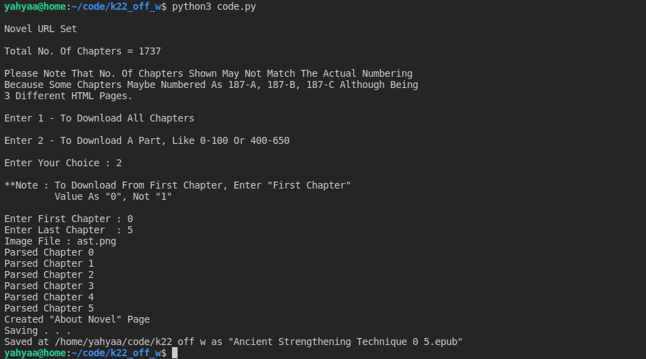

 

# About: 
<b>Python Script To Copy [WuxiaWorld](https://www.wuxiaworld.com/) Chapters Into EPUB File.</b>

Copies The Novel Chapters Along With Novel Details And Sometimes(Once Every 6-10 Times Code Is Run) 'Not' The Cover Image (IDK Why ? Maybe Because Of BeautifulSoup4 Internal Problem).

How Does The Script Work ? Just Enter The Novel URL Inside The Script And The Rest Follows.

<h4>I'll Try To Add Any Necessary Updates.</h4>

<h4> Initial Implementation By :  <a href="https://forum.wuxiaworld.com/discussion/7006/script-html-to-epub">Aundinn</a> </h4>

 

## **Note : 
Check this other website for reading novels: http://m.wxuiaworld.co . Ask Me, Why This Website? Well, It Has Novels From **Webnovel(Qidan) & WuxiaWorld** With All Latest Chapters <b>Unlocked</b>. 

**No Spirit Stones, No Patreon, No Subscription Or Any Of Those Things Required To Read The Latest Chapters!**
Don't Take My Word For It ? Check It Out.

 

## Task(s) :
- [x] Get List Of Chapters From Novel Website And Use Links From The List Rather Than Progress Sequentially Because Of The Arising Problem Of Some Pages Not Having Sequential Names.

## Problem(s) :
* None Yet(Report if any).

## Screenshot :

## Documentation :
1. For Beginners, After Setting Up A Working Python 3 Environment(Along With Latest `pip`), You Need To Install Some Packages. To Install, Run These Commands In Your CMD/Terminal :
   * `pip3 install bs4`
   * `pip3 install ebooklib`
   * `pip3 install requests`
   * `pip3 install html5lib=="0.9999999"` 

2. Download The Python Script And Unzip It.

3. Open The Script With A Text Editor And Read The Details Inside.

4. In Case The Script Was Not Updated According To The Changes In Website, You Might Refer The [**BeautifulSoup Docs**](https://www.crummy.com/software/BeautifulSoup/bs4/doc/) To Make Changes Accordingly.

4. To Run, Open CMD/Terminal, Navigate To The Unzip Location And Type :
   * Linux -`python3 code.py`
   * Windows - `python code.py` or `py code.py`

5. EPUB File Will Be Saved At The Location Of Script.

### Working :
* Set Novel Link in `novelURL`
   * Example - https://www.wuxiaworld.com/novel/martial-god-asura | https://www.wuxiaworld.com/novel/a-will-eternal
* If Specific No. Of Chapters Are To Be Downloaded, Then Enter 2 And Provide The `start` And `end` Chapters.
* EPUB File Will Be Saved In The Format `NovelName_start-chapter_end-chapter.epub`

### Parsing :
`html5lib` Is Used Because Although Being Tiny Winy Bit Slow, It Generates Valid HTML. You May Compare Others Here, [**Differences Between Parsers**](https://www.crummy.com/software/BeautifulSoup/bs4/doc/#differences-between-parsers).
I've Copied The Table From BS4 Website Below To Give A Faint Overview.

<table border="1" class="docutils">
<colgroup><col width="18%"><col width="35%"><col width="26%"><col width="21%"></colgroup>
<tbody valign="top">
   <tr class="row-odd"><td><b>Parser</b></td>
      <td><b>Typical usage</b></td>
      <td><b>Advantages</b></td>
      <td><b>Disadvantages</b></td>
   </tr>
   <tr class="row-even"><td><b>Python’s html.parser</b></td>
      <td><code class="docutils literal">BeautifulSoup(markup, "html.parser")</code></td>
      <td><ul class="first last simple">
            <li>Batteries included</li>
            <li>Decent speed</li>
            <li>Lenient (as of Python 2.7.3 and 3.2.)</li>
         </ul>
      </td>
      <td><ul class="first last simple">
            <li>Not very lenient (before Python 2.7.3 or 3.2.2)</li>
         </ul>
      </td>
   </tr>
   <tr class="row-odd"><td><b>lxml’s HTML parser</b></td>
      <td><code class="docutils literal">BeautifulSoup(markup, "lxml")</code></td>
      <td><ul class="first last simple">
            <li>Very fast</li>
            <li>Lenient</li>
          </ul>
      </td>
      <td><ul class="first last simple">
            <li>External C dependency</li>
          </ul>
      </td>
   </tr>
   <tr class="row-even"><td><b>lxml’s XML parser</b></td>
      <td><code class="docutils literal">BeautifulSoup(markup, "lxml-xml")</code>
   <code class="docutils literal">BeautifulSoup(markup, "xml")</code></td>
      <td><ul class="first last simple">
            <li>Very fast</li>
            <li>The only currently supported XML parser</li>
          </ul>
      </td>
      <td><ul class="first last simple">
            <li>External C dependency</li>
          </ul>
      </td>
   </tr>
   <tr class="row-odd"><td><b>html5lib</b></td>
      <td><code class="docutils literal">BeautifulSoup(markup, "html5lib")</code></td>
      <td><ul class="first last simple">
            <li>Extremely lenient</li>
            <li>Parses pages the same way a web browser does</li>
            <li>Creates valid HTML5</li>
          </ul>
      </td>
      <td><ul class="first last simple">
            <li>Very slow</li>
            <li>External Python dependency</li>
          </ul>
      </td>
   </tr>
</tbody>
</table>

#### If Any Problem Occurs With `html5lib` :
* In Case You Update It Accidentally, You Can Reinstall The Specific Version By Checking The Details For Beginners.
* Another Choice, Change `html5lib` To `lxml` - **If Installed**, Otherwise To Python's Inbuilt `html.parser` .

 

## License

Copyright &copy; 2018 [Kogam22](https://github.com/Kogam22). Released under the terms of the [Apache 2.0 license](LICENSE).
